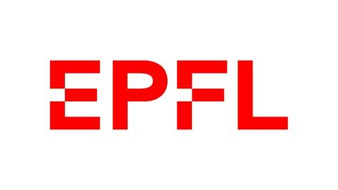
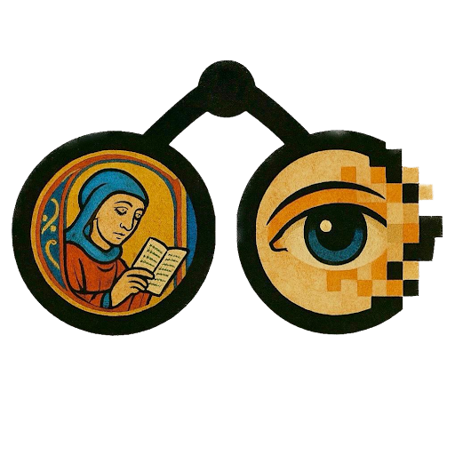

# Fine-tuning d’un Vision-Language Model pour l’annotation iconographique (*timel*)
## Projet O.D.I.L. — Hackathon du Master Humanités numériques (École nationale des chartes)

<p align="center">
  
  
  
  
</p>


## 1. Présentation du projet

<table>
<tr>
<td width="180" align="center" valign="top">
  
</td>
<td>

Ce dépôt documente les expérimentations menées dans le cadre du projet **O.D.I.L.**, dont l’objectif est l’annotation iconographique automatique d’images patrimoniales, en particulier de manuscrits médiévaux.

Le projet vise à associer des images à une **taxonomie iconographique contrôlée (*timel*)**, en respectant des contraintes de cohérence, de reproductibilité et d’exploitabilité requises dans un contexte patrimonial.

</td>
</tr>
</table>

---

## 2. Exploration méthodologique dans le projet O.D.I.L.

### 2.1 Pistes explorées en parallèle

Au début du projet, plusieurs **pistes méthodologiques ont été explorées en parallèle** par les membres de l’équipe, afin d’évaluer différentes approches possibles pour l’annotation iconographique automatique.

Ces explorations incluent notamment :
- des approches reposant sur des modèles visuels ou multimodaux sans entraînement spécifique ;
- des expérimentations basées sur des Vision-Language Models (VLM) en configuration zero-shot ;
- d’autres stratégies expérimentales développées par les membres de l’équipe.

Cette phase exploratoire avait pour objectif d’identifier les limites pratiques et méthodologiques de chaque approche.

---

### 2.2 Piste A — Expérimentations VLM en configuration zero-shot

Des expériences ont été menées avec des Vision-Language Models généralistes (Qwen3-VL versions 2.0B et 4.0B), utilisés **sans entraînement préalable** sur la taxonomie *timel*.

Deux formulations de prompt ont été testées :
- demande explicite de génération d’identifiants de classes *timel* ;
- demande de génération de labels en langage naturel supposés correspondre à la taxonomie.

Les observations principales sont les suivantes :
- le modèle ne possède aucune connaissance explicite de la taxonomie *timel* ;
- il génère des identifiants inexistants ou arbitraires ;
- les labels produits sont descriptifs mais non alignés avec le vocabulaire contrôlé.

Une tentative intermédiaire a consisté à générer une description de l’image, puis à apparier a posteriori les mots produits avec le fichier `classe.tsv`.  
Cette approche, fondée sur une correspondance lexicale, ne garantit ni cohérence ni reproductibilité, et ne répond pas aux exigences d’une annotation fondée sur une taxonomie fermée.

Modèle comparatif testé (pré-entraîné / fine-tuné sur Iconclass) :
- `small-models-for-glam/iconclass-vlm` : le modèle produit des sorties structurées en codes Iconclass, mais ces codes ne sont pas alignés avec la taxonomie *timel* et ne sont pas directement transférables sans ré-entraînement.


---

### 2.3 Piste B — Approche CLIP (à compléter / résumé minimal)

Cette section est dédiée à une piste explorée en parallèle reposant sur des modèles visuels de type **CLIP**, utilisés pour produire des scores (ou probabilités) sur l’espace des catégories.

**À compléter par le ou les contributeurs concernés :**
- description de l’approche testée (scores, top-k, etc.) ;
- format des sorties produites (CSV, tableau de probabilités, etc.) ;
- principaux résultats observés et limites identifiées.

---

### 2.4 Convergence vers une approche commune

À l’issue de ces explorations parallèles, l’équipe a convergé vers une approche commune fondée sur le **fine-tuning supervisé d’un Vision-Language Model**, inspirée du pipeline développé pour Iconclass.

Ce choix repose sur les constats suivants :
- les approches sans apprentissage supervisé ne respectent pas une taxonomie iconographique fermée ;
- un alignement explicite entre images et labels contrôlés est nécessaire ;
- les sorties doivent être stables, reproductibles et directement exploitables dans le cadre du projet O.D.I.L.

---

## 3. Principe général du pipeline retenu

La tâche d’annotation iconographique est reformulée comme une **génération textuelle strictement contrôlée**, où le modèle apprend à associer une image à une liste fermée de labels *timel*.

Les labels sont considérés comme des **chaînes de caractères fixes**, et non comme du langage naturel libre.

---

## 4. Préparation et nettoyage des données

### 4.1 Sources des données
- Images : manuscrits médiévaux (projet O.D.I.L.)
- Labels : taxonomie *timel* définie dans `classe.tsv`

### 4.2 Nettoyage et filtrage
- vérification de l’existence et de la lisibilité des images ;
- suppression des labels hors vocabulaire *timel* ;
- exclusion des échantillons sans label valide ;
- déduplication des images ;
- séparation train / validation avec graine fixe.

### 4.3 Préparation des prompts (analyse exploratoire)

Avant la phase de fine-tuning, une étape exploratoire a été testée pour structurer les exigences de description et/ou guider la conception des prompts, via des regroupements visuels (ex. **clustering VGG16**).

Objectifs :
- regrouper des images par similarité visuelle pour faciliter l’analyse iconographique ;
- définir des exigences de sortie (structure, éléments saillants, cas transcatégoriels).

---

## 5. Structure des données et format d’entraînement

Les données sont stockées au format **JSONL**, un échantillon par ligne.

Chaque échantillon est formulé comme une interaction multimodale :
- **Entrée (user)** : image + instruction explicite ;
- **Sortie (assistant)** : liste de labels *timel* uniquement, sans texte descriptif.

Format de sortie attendu (exemple) :
- IDs séparés par `;`
- aucun texte libre
- aucun label hors vocabulaire

---

## 6. Pipeline d’entraînement supervisé (SFT)

- Modèle : **Qwen 3.0 Vision-Language Model** (évolution depuis une base Qwen 2.5 testée au départ)
- Méthode : Supervised Fine-Tuning (SFT)
- La loss est calculée uniquement sur la sortie *assistant* ;
- entraînement piloté par `max_steps` ;
- reprise automatique à partir des checkpoints ;
- export final du modèle entraîné.

Ce pipeline est **inspiré des travaux Iconclass**, sans réutilisation de modèles ou de poids pré-entraînés sur Iconclass.

---

## 7. Inférence et post-traitement

Lors de l’inférence :
1. le modèle génère une chaîne de labels ;
2. la sortie est normalisée (séparation, suppression des doublons) ;
3. les labels hors vocabulaire *timel* sont filtrés.

Cette étape garantit la conformité des résultats à la taxonomie cible.

---

## 8. Installation

### 8.1 Dépendances

Installer les dépendances :
```bash
pip install -r requirements.txt

## 9. Prompt for VLM Qwen 3.0

You are a medieval art historian. You will work with a set of medieval religious images that need to be paired with a group of TIMEL style labels.
Your task is to assign each image to the most appropriate style category based on its compositional structure, background treatment, relationships between figures, and the relationship between image and text. You must also produce a structured description for each image to support subsequent automated image description and analysis.

General Guidelines

All images depict medieval religious narratives.

Style classification is based primarily on visual structure + narrative mode.

Categories are not absolute; flexible judgment based on visual features is encouraged.

Style Category Definitions (17 categories)

Category 1
Loose composition; background dominated by colorful decorative patterns; includes both group scenes and single figures.

Category 2
Compact composition; heterogeneous background styles; densely packed figures with high visual clustering.

Category 3
Relatively loose composition; extensive use of blank or open background space; figures are spatially separated but show clear interaction.

Category 4
Compact composition; strong overlap between text and image; backgrounds are often replaced by text or feature interwoven text and imagery.

Category 5
Loose composition; dominated by a single figure; a highly symbolic and intertextual relationship between the figure and the background.

Category 6
Bipartite left–right composition; background in pink or light tones; very strong figural interaction.

Category 7
Compact composition; dense interweaving of text and image; images frequently enclosed within shapes; backgrounds largely composed of text; heavy use of gold is a defining feature.

Category 8
Centralized composition; the narrative core is placed at the center; the background unfolds around the center; high narrative density with limited textual support.

Category 9
Symmetrical composition; complex backgrounds; dense and interlaced figure relationships, predominantly featuring angels.

Category 10
Loose composition; mostly plain or monochrome backgrounds; overall appearance resembles line drawing or sketch with minimal coloring; figures intersect in complex ways.

Category 11
Visual focus concentrated on a single focal point; clean background; may include single or multiple figures with overlapping placement.

Category 12
Centralized composition; background composed of colorful patterns; includes both group scenes and single figures.

Category 13
Compact composition; strong fusion of text and image; images often enclosed by shapes; backgrounds commonly composed of text; style may be linear or densely packed.

Category 14
Centralized composition; clearly defined narrative core; background organized around the center; rich narrative content with minimal text.

Category 15
Tripartite composition (upper / middle / lower registers); unified background style, often flame-like or similar; the lower register functions as a summary or conclusion of the upper scenes.

Category 16
Symmetrical composition (left–right, top–bottom, or triptych); simple background with monochrome or repetitive patterns; tightly connected figures with strong interaction.

Category 17
Vertically symmetrical (top–bottom) composition; simple background dominated by monochrome patterns; frequent figural interaction and clear narrative relationships.

Output Requirements

Identify the style category number that best matches the image.

Provide a 2–4 sentence structured description addressing composition, figural relationships, and image–text relations.

If cross-category features are present, specify “primary category + secondary features.”
